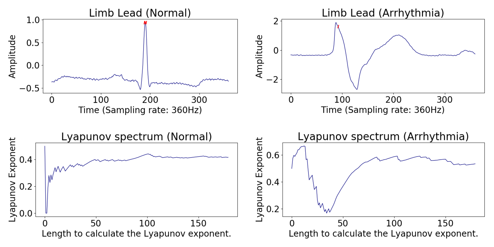
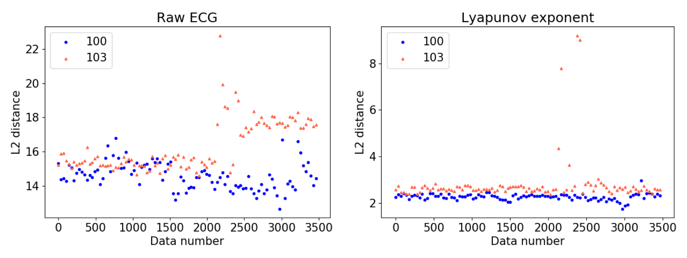

Arrhythmia Detection in ECG based on RNN Encoder–Decoder with Lyapunov Exponent
=====

## Introduction
This repository provides the source code of the paper <a href="https://onlinelibrary.wiley.com/doi/full/10.1002/tee.22927">"Arrhythmia Detection in Electrocardiogram based on Recurrent Neural Network Encoder–Decoder with Lyapunov Exponent"</a>.

<div align="center">
    
  <p>The sample raw and preprocessed data. The sampling rate of raw ECG is 360 Hz. We extract 180-dimensional Lyapunov spectrum (LS) from the 360-dimensional ECG signal.</p>
</div>

<div align="center">
    
  <p>The structure of RNN Encoder-Decoder. The input of this RNN is LS and RNN reconstruct the output same as input. Above RNN cannot reconstruct unseen data well, so reconstruction error of arrhythmia ECG is lager than healthy ECG.</p>
</div>

<div align="center">
    
  <p>Comparison of the effect of using the Lyapunov exponent. Label '100' and '103' are normal (healthy) and mixed (healthy and arrhythmia). Two subfigures are shown, Euclidean distance (restoration error) of using raw ECG and Lyapunov exponent, respectively. In the right subfigure, the data that have a higher value than others contain arrhythmia.</p>
</div>

<div align="center">
    
  <p>The example of arrhythmia detection. Label '100', '103', and '107' are normal (healthy), mixed (healthy and arrhythmia), and arrhythmia respectively.</p>
</div>

## Requirements
* Python 3.5.2  
* Tensorflow 1.4.0  
* Numpy 1.13.3  
* Scipy 1.2.0  
* Matplotlib 3.0.2  

## Database
You can download the original <a href="https://physionet.org/physiobank/database/mitdb/">MIT-BIH Arrhythmia Database</a> in physiobank.


### BibTeX
```
@Article{doi:10.1002/tee.22927,
  author = {Park, YeongHyeon and Yun, Il Dong},
  title = {Arrhythmia detection in electrocardiogram based on recurrent neural network encoder–decoder with Lyapunov exponent},
  journal = {IEEJ Transactions on Electrical and Electronic Engineering},
  volume = {0},
  number = {0},
  keywords = {arrhythmia detection, recurrent neural network encoder-decoder Lyapunov exponent},
  doi = {10.1002/tee.22927},
  url = {https://onlinelibrary.wiley.com/doi/abs/10.1002/tee.22927},
  eprint = {https://onlinelibrary.wiley.com/doi/pdf/10.1002/tee.22927},
}
```
